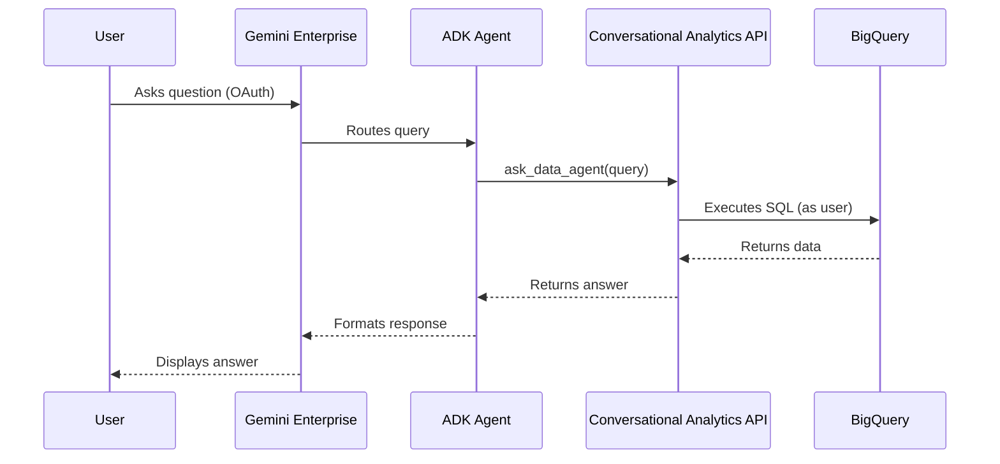
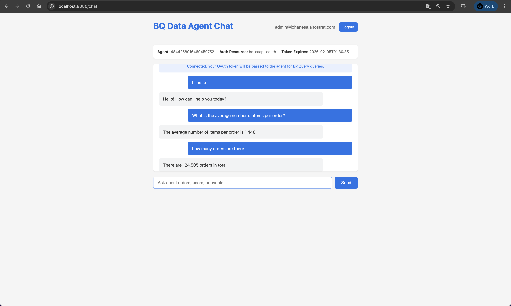

# Gemini Conversational Analytics ADK Demo

Deploy Google ADK Agents that bridge the Conversational Analytics API with Gemini Enterprise using OAuth identity passthrough.

## Architecture



**Key Feature:** OAuth identity passthrough ensures queries execute with the end user's BigQuery permissions.

## Project Structure

```text
├── app/
│   └── cbs/                    # CBS Analyst Agent
│       ├── agent.py            # Agent definition + DataAgentToolset
│       └── .env                # Runtime environment variables
├── docs/
│   ├── examples/               # Reference implementations
│   │   └── chart_with_ca_api.py  # Custom CA API call with chart support
│   ├── gemini-enterprise-demo.png
│   └── test-web-demo.png
├── scripts/
│   ├── admin_tools.py          # Manage Data Agents (backend)
│   ├── setup_auth.py           # Create OAuth resources
│   ├── register_agents.py      # Register with Gemini Enterprise
│   └── deploy_agents.sh        # Automated deployment
├── test_web/                   # OAuth test harness
│   ├── app.py                  # Flask app for local testing
│   └── templates/              # HTML templates
├── .env                        # Environment variables
└── README.md
```

## Prerequisites

1. Python 3.11+ with `uv` package manager
2. Google Cloud Project with APIs enabled:
   - Vertex AI API
   - Conversational Analytics API
   - Discovery Engine API
   - BigQuery API
3. OAuth 2.0 Client Credentials (Client ID + Secret)
4. gcloud CLI authenticated:
   ```bash
   gcloud auth application-default login
   gcloud auth login
   ```

## Setup

### 1. Install Dependencies

```bash
python3 -m venv .venv
source .venv/bin/activate
pip install -r requirements.txt
```

### 2. Configure Environment

```bash
cp .env.example .env
```

Edit `.env` with your project details:
```bash
GOOGLE_CLOUD_PROJECT=your-project-id
GOOGLE_CLOUD_PROJECT_NUMBER=your-project-number
AGENT_ID=your-cbs-data-agent-id
GEMINI_APP_ID=your-gemini-app-id
OAUTH_CLIENT_ID=your-oauth-client-id
OAUTH_CLIENT_SECRET=your-oauth-client-secret
```

Create per-agent `.env` files:

```bash
# app/cbs/.env
cat > app/cbs/.env << EOF
GOOGLE_CLOUD_PROJECT=your-project-id
AGENT_ID=your-cbs-data-agent-id
OAUTH_CLIENT_ID=your-oauth-client-id
OAUTH_CLIENT_SECRET=your-oauth-client-secret
EOF
```

### 3. Create Backend Data Agents

```bash
python scripts/admin_tools.py
```

## Deployment

### Step 1: Deploy to Agent Engine

```bash
bash scripts/deploy_agents.sh
```

Save the Reasoning Engine resource names from the output.

### Step 2: Setup OAuth Authorization

```bash
python scripts/setup_auth.py
```

### Step 3: Register with Gemini Enterprise

```bash
# Register CBS agent
python scripts/register_agents.py \
  --resource-name <RESOURCE_NAME>
```

### Step 4: Test

Access Gemini Enterprise to see "CBS" agents. CBS is a Core Banking System Analyst Agent to answer questions about the CIF, Account and Products.

## Migration to a New Project

If you are migrating the CBS Agent to a completely new GCP project, follow these ordered implementation steps:

1. **Enable APIs**: Ensure Vertex AI, Conversational Analytics, Discovery Engine, and BigQuery APIs are enabled in the new project's Cloud Console.
2. **Environment**: Update your `.env` file with the new `GOOGLE_CLOUD_PROJECT` identifier.
3. **Data Agent Backend**: Run `python scripts/admin_tools.py` to create the Data Agent metadata in the new project. Copy the newly created Agent ID to `AGENT_ID` in `.env`.
4. **OAuth Client**: Create a new Web OAuth Client in the new project. Ensure to add the Discovery Engine and test web app redirect URIs. Add the generated credentials (`OAUTH_CLIENT_ID` and `OAUTH_CLIENT_SECRET`) to your `.env` file.
5. **Auth Resource**: Run `python scripts/setup_auth.py` to create the enterprise authorization resource in the new project.
6. **Agent Engine Deployment**: Run `bash scripts/deploy_agents.sh` to upload the code to the Reasoning Engine. Copy the printed Reason Engine ID to `REASONING_ENGINE_ID` in `.env`.
7. **Registration**: Finally, register the deployed agent by running `python scripts/register_agents.py --resource-name projects/<YOUR_PROJECT_NUMBER>/locations/us-central1/reasoningEngines/<REASONING_ENGINE_ID>`.

## Sample Queries

**CBS Agent:**
- "How many customers do we have mapped to the Priority segment?"
- "What is the total balance across all Savings accounts?"
- "List the most recent 10 transactions of type 'deposit'."

## Local Development

Test agents locally:

```bash
export $(cat .env | xargs)
adk run app/cbs
```

## Local Testing with OAuth

Test the OAuth passthrough flow using the test web app:

```bash
cd test_web
python3 -m venv .venv
source .venv/bin/activate
pip install -r requirements.txt
python app.py
```


Open http://localhost:8080, login with Google, and query the agent.

> [!TIP]
> **Accessing from outside Cloudtop**
> If you are running `test_web` on your Cloudtop instance but want to test it via your local laptop's browser (e.g. MacBook), you should use SSH local port forwarding. This ensures your browser hits `localhost:8080`, which perfectly matches the required OAuth Client redirect URI.
> 
> Run this command **from your local laptop's terminal** (replace `cloudtop-ynd-glinux` with yours):
> ```bash
> ssh -L 8080:localhost:8080 cloudtop-ynd-glinux.c.googlers.com
> ```
> Once connected, simply open [http://localhost:8080](http://localhost:8080) on your laptop.
**Prerequisites:**
- Add `http://localhost:8080/auth/callback` to OAuth client redirect URIs in Cloud Console
- Set `ORDERS_REASONING_ENGINE_ID` in root `.env`

## Demo

### Gemini Enterprise


*CBS responding to queries in Gemini Enterprise*

### Test Web App



*Local OAuth test harness showing token passthrough*

## Limitations

### Chart Visualization

The ADK's built-in `DataAgentToolset` does not currently support chart responses
from the Conversational Analytics API. The CA API returns Vega-Lite specifications
in `systemMessage.chart.result.vegaConfig`, but the toolset only processes `text`,
`schema`, and `data` messages.

To add chart support, implement a custom tool that calls the CA API directly
and parses the `chart` messages from the streaming response.

See [`docs/examples/chart_with_ca_api.py`](docs/examples/chart_with_ca_api.py) for
a reference implementation that demonstrates:

- Direct CA API calls with OAuth credentials
- Parsing streaming responses including chart data
- Rendering Vega-Lite specs to PNG using Altair

## License

Demonstration project for educational purposes.
